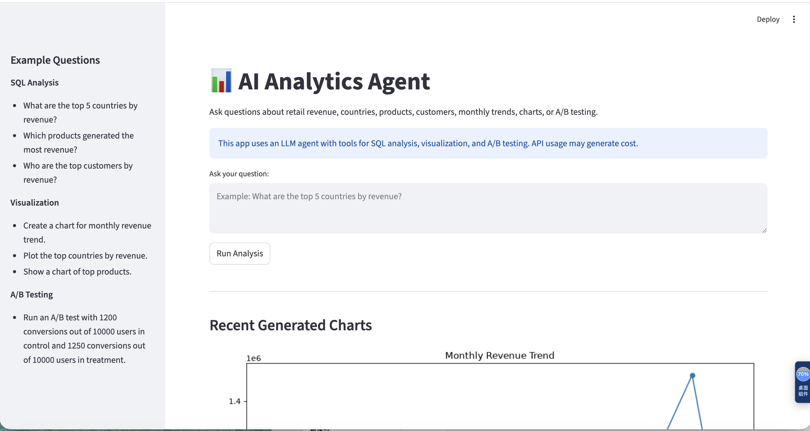
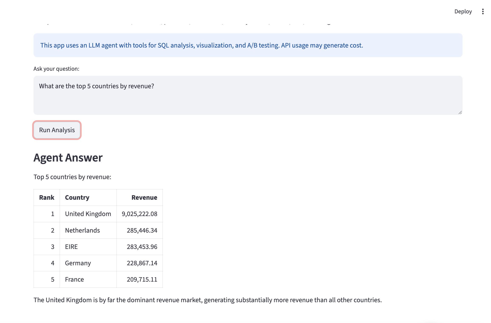
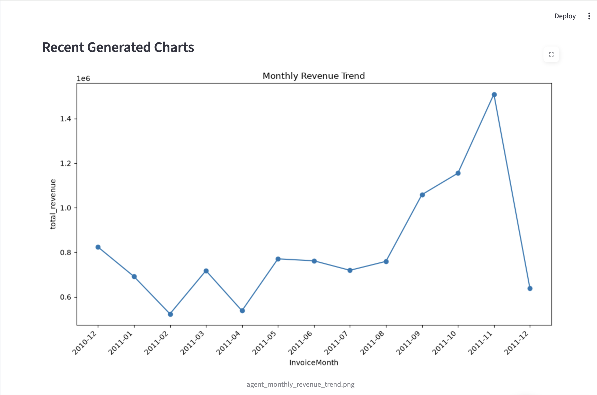
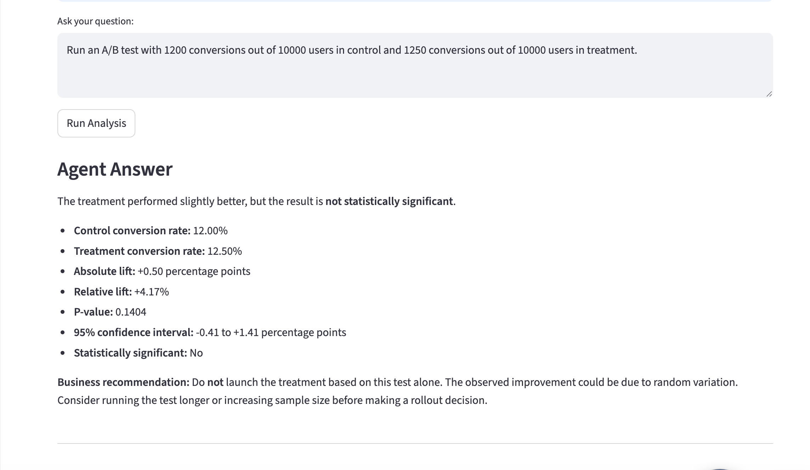

# AI Analytics Agent

## Project Overview

This project is an AI-powered analytics agent that allows users to ask natural-language questions about business data. The agent can query a SQLite database, generate visualizations, run A/B testing analysis, and summarize results into business insights.

The goal of this project is to demonstrate how large language models can be connected with data analysis tools to support self-service analytics for non-technical users.

---

## Features

- Natural-language analytics interface
- SQL-based retail revenue analysis
- Automated chart generation
- A/B testing evaluation
- Business insight generation
- Streamlit web application

---

## Tech Stack

- Python
- pandas
- SQLite
- matplotlib
- statsmodels
- LangChain
- OpenAI API
- Streamlit

---

## Project Structure

```text
AI-analytics-agent/
├── agent/
│   └── analytics_agent.py
├── app/
│   ├── basic_analytics_assistant.py
│   └── streamlit_app.py
├── scripts/
│   └── create_database.py
├── tools/
│   ├── sql_tool.py
│   ├── visualization_tool.py
│   └── ab_test_tool.py
├── screenshots/
├── requirements.txt
├── .env.example
├── .gitignore
└── README.md
```

Core Capabilities

1. SQL Analytics

The agent can answer questions such as:

- What are the top 5 countries by revenue?
- Which products generated the most revenue?
- Who are the top customers by revenue?

The SQL tool only allows safe SELECT queries to prevent accidental modification of the database.

⸻

2. Visualization

The agent can generate charts for common business analyses, including:

- Monthly revenue trend
- Top countries by revenue
- Top products by revenue
- Top customers by revenue

Generated charts are saved locally in the outputs/ folder.

⸻

3. A/B Testing

The A/B testing tool compares control and treatment conversion rates using a two-proportion z-test.

It returns:

- Control conversion rate
- Treatment conversion rate
- Absolute lift
- Relative lift
- Z-statistic
- P-value
- 95% confidence interval
- Business recommendation

Dashboard Preview

The Streamlit web application provides a simple interface for users to ask natural-language analytics questions and receive AI-generated answers, SQL-based results, visualizations, and A/B testing recommendations.

Streamlit App Interface

The main interface allows users to enter business questions and run analysis through the AI Analytics Agent. Example questions are provided in the sidebar to demonstrate SQL analysis, visualization, and A/B testing capabilities.

⸻

SQL Analysis Result

The agent can answer revenue-related business questions by generating and executing safe SQL queries against the SQLite retail database. The result is summarized into clear business insights for decision-making.

⸻

Monthly Revenue Visualization

The visualization tool generates charts automatically based on user requests. For example, the monthly revenue trend chart helps identify seasonal sales patterns and peak revenue periods.

⸻

A/B Testing Result

The A/B testing tool evaluates experiment performance by calculating conversion rates, lift, p-value, confidence interval, statistical significance, and a business recommendation.

## Dashboard Preview

### Streamlit App Interface



### SQL Analysis Result



### Monthly Revenue Visualization



### A/B Testing Result



Business Value

This project shows how AI agents can help automate routine analytics workflows. Instead of manually writing SQL, creating charts, and interpreting results, users can ask questions in natural language and receive data-driven answers with business context.

Potential use cases include:

- Self-service business intelligence
- Revenue monitoring
- Customer segmentation
- Experiment analysis
- KPI reporting automation

⸻

Notes

The raw dataset, generated SQLite database, API keys, and output charts are not included in this repository for file size and security reasons.
